# Flowchart Sistem DES + RSA Secure Chat

```mermaid
flowchart TD
    Start([Start]) --> ServerInit[Server: Inisialisasi<br/>Generate RSA Keypair<br/>Public Key e, n<br/>Private Key d, n]
    ServerInit --> ServerListen[Server: Listen di HOST:PORT]
    
    ServerListen --> ClientConnect[Client: Connect ke Server]
    ClientConnect --> ClientStore[Server: Simpan Client Socket]
    
    ClientStore --> SendPubKey[Server: Kirim Public Key e, n<br/>via JSON]
    SendPubKey --> ClientReceivePub[Client: Terima Public Key e, n]
    
    ClientReceivePub --> ClientVerify[Client: Enkripsi 'CLIENT_HELLO'<br/>menggunakan RSA Public Key]
    ClientVerify --> SendVerify[Client: Kirim Encrypted Verification]
    
    SendVerify --> ServerDecrypt[Server: Dekripsi dengan<br/>RSA Private Key d, n]
    ServerDecrypt --> VerifyCheck{Verifikasi<br/>== 'CLIENT_HELLO'?}
    
    VerifyCheck -->|No| KeyFail[Key Exchange Gagal]
    KeyFail --> End([End])
    
    VerifyCheck -->|Yes| GenerateMaster{Master Key<br/>sudah ada?}
    GenerateMaster -->|No| CreateMaster[Server: Generate Master Key<br/>Random 8 karakter]
    GenerateMaster -->|Yes| UseMaster[Server: Gunakan Master Key existing]
    
    CreateMaster --> SendMaster[Server: Kirim Master Key<br/>DES via JSON]
    UseMaster --> SendMaster
    
    SendMaster --> ClientReceiveMaster[Client: Terima Master Key DES]
    ClientReceiveMaster --> CheckClients{Jumlah Client<br/>>= 2?}
    
    CheckClients -->|No| WaitMore[Server: Kirim 'wait' ke semua client<br/>Client: Tunggu client lain]
    WaitMore --> ServerListen
    
    CheckClients -->|Yes| SendReady[Server: Kirim 'ready' ke semua client]
    SendReady --> ChatReady[Semua Client: Chat Ready!]
    
    ChatReady --> ClientInput[Client: Input Pesan Plaintext]
    ClientInput --> QuitCheck{Pesan == 'quit'?}
    
    QuitCheck -->|Yes| SendQuit[Client: Kirim JSON type='quit']
    SendQuit --> ServerNotifyQuit[Server: Broadcast quit ke client lain]
    ServerNotifyQuit --> Disconnect[Client: Disconnect]
    Disconnect --> CheckRemaining{Client<br/>tersisa < 2?}
    
    CheckRemaining -->|Yes| SendWait[Server: Kirim 'wait']
    SendWait --> ServerListen
    CheckRemaining -->|No| ChatReady
    
    QuitCheck -->|No| DESEncrypt[Client: Enkripsi Pesan<br/>menggunakan DES Master Key]
    
    DESEncrypt --> DESProcess1[des_lib.py:<br/>1. Pad plaintext kelipatan 8 bytes<br/>2. Konversi ke bits]
    DESProcess1 --> DESProcess2[des_lib.py:<br/>3. Generate 16 subkeys dari Master Key<br/>4. Initial Permutation IP]
    DESProcess2 --> DESProcess3[des_lib.py:<br/>5. 16 rounds Feistel:<br/>- Expansion E<br/>- XOR dengan subkey<br/>- S-boxes substitution<br/>- Permutation P]
    DESProcess3 --> DESProcess4[des_lib.py:<br/>6. Final Permutation FP<br/>7. Konversi ke Base64 format]
    
    DESProcess4 --> SendEncrypted[Client: Kirim JSON<br/>type='message'<br/>sender_name<br/>ciphertext Base64<br/>timestamp]
    
    SendEncrypted --> ServerReceive[Server: Terima Ciphertext]
    ServerReceive --> ServerDecryptDES[Server: Dekripsi dengan DES<br/>menggunakan Master Key]
    
    ServerDecryptDES --> DESDecrypt1[des_lib.py:<br/>1. Konversi Base64 ke bits<br/>2. Initial Permutation IP]
    DESDecrypt1 --> DESDecrypt2[des_lib.py:<br/>3. 16 rounds Feistel reversed<br/>dengan subkeys terbalik<br/>4. Final Permutation FP]
    DESDecrypt2 --> DESDecrypt3[des_lib.py:<br/>5. Konversi bits ke string<br/>6. Unpad plaintext]
    
    DESDecrypt3 --> ServerLog[Server: Log Plaintext]
    ServerLog --> ServerBroadcast[Server: Broadcast ciphertext<br/>ke client lain]
    
    ServerBroadcast --> OtherClientReceive[Client Lain: Terima Ciphertext]
    OtherClientReceive --> OtherDecrypt[Client Lain: Dekripsi dengan DES<br/>menggunakan Master Key yang sama]
    OtherDecrypt --> DisplayPlain[Client Lain: Tampilkan Plaintext<br/>dengan nama pengirim]
    
    DisplayPlain --> ChatReady
    
    style Start fill:#90EE90
    style End fill:#FFB6C1
    style ServerInit fill:#87CEEB
    style ClientConnect fill:#DDA0DD
    style DESEncrypt fill:#FFD700
    style DESProcess1 fill:#FFA07A
    style DESProcess2 fill:#FFA07A
    style DESProcess3 fill:#FFA07A
    style DESProcess4 fill:#FFA07A
    style ServerDecryptDES fill:#FFD700
    style DESDecrypt1 fill:#FFA07A
    style DESDecrypt2 fill:#FFA07A
    style DESDecrypt3 fill:#FFA07A
    style SendPubKey fill:#98FB98
    style ClientVerify fill:#F0E68C
    style ServerDecrypt fill:#F0E68C
    style ChatReady fill:#00CED1
```

## Penjelasan Alur:

### 1. **Inisialisasi Server (rsa_lib.py)**
- Server generate RSA keypair (512-bit)
- Public key `(e, n)` untuk distribusi
- Private key `(d, n)` disimpan server

### 2. **Key Exchange (RSA)**
- Server kirim public key ke client
- Client verifikasi dengan enkripsi 'CLIENT_HELLO'
- Server dekripsi dan verifikasi
- Server generate/kirim Master Key DES (8 karakter)

### 3. **Enkripsi Pesan (des_lib.py)**
- Client enkripsi plaintext dengan DES
- Proses: Padding → 16 rounds Feistel → Base64
- Kirim ciphertext ke server

### 4. **Dekripsi & Broadcast (des_lib.py)**
- Server dekripsi dengan DES (log plaintext)
- Broadcast ciphertext ke client lain
- Client lain dekripsi dan tampilkan

### 5. **Komunikasi Berlanjut**
- Loop chat hingga client 'quit'
- Jika client < 2, tunggu client baru

## File Responsibilities:
- **rsa_lib.py**: Generate keypair, encrypt/decrypt RSA
- **des_lib.py**: Encrypt/decrypt DES, padding, permutasi, S-boxes
- **server.py**: Orchestrator, key distribution, broadcast
- **client.py**: UI, enkripsi pesan, dekripsi pesan

